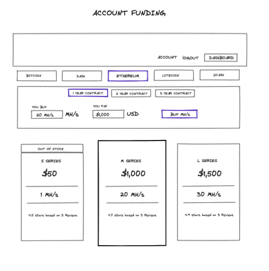
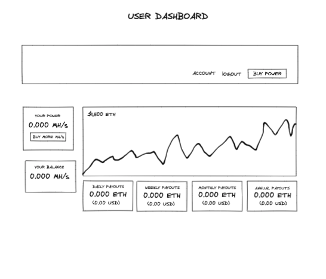
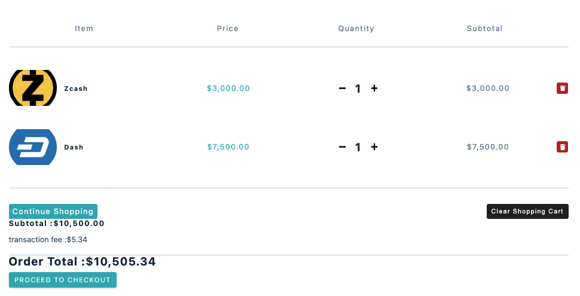
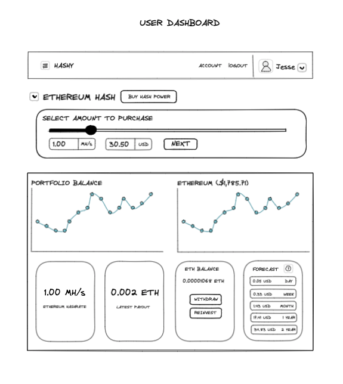
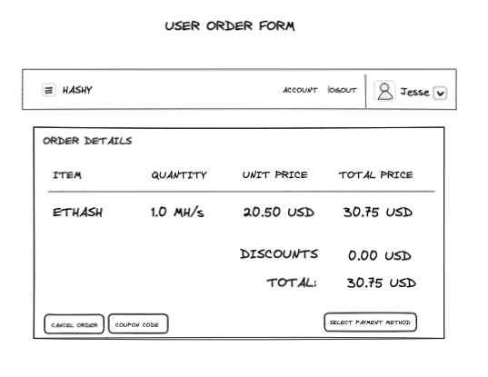

# HASHY


## User Story

The user wants to create an account and purchase hashrate power to start mining their favorite crypto's. They want to easily purchase hashrate. The user will be able to login to their account and see their hashing power for each crypto they are mining. 

## Criteria
### Key features for user:
- Easily navigate through the site
- Add items to cart
- Checkout and pay for items
- Filter through item by price, name, and category

## Wire Frame
### Home Page




## Code
### Product

``` js
import React from 'react'
import styled from 'styled-components'
import { formatPrice } from '../utils/helpers'
import { FaBitcoin } from 'react-icons/fa'
import { Link } from 'react-router-dom'

const Product = ({ imgUrl, name, price, id }) => {
  return (
    <Wrapper>
      <div className='container'>
        
        <Link to={`/products`} className='link'>
          <FaBitcoin />
        </Link>
      </div>
      <footer>
        <h5>{name}</h5>
        <p>{formatPrice(price)}</p>
      </footer>
    </Wrapper>
  )
}
```

### API

``` js
const CryptoPrices = () => {
    const [coins, setCoins] = useState([]);
    const [search, setSearch] = useState('');

    useEffect(() => {
    axios
        .get(
            'https://api.coingecko.com/api/v3/coins/markets?vs_currency=usd&order=market_cap_desc&per_page=25&page=1&sparkline=false'
        )
        // 237 coins
        .then(res => {
            setCoins(res.data);
            // console.log(res.data);
        })
        .catch(error => console.log(error));
    }, []);

    const handleChange = e => {
        setSearch(e.target.value);
    };

    const filteredCoins = coins.filter(coin =>
        coin.name.toLowerCase().includes(search.toLowerCase())
    );

  return (
    <main>
        <Wrapper className='section section-center'>
            <article>
                <div className='coin-app'>
                <div className='coin-search'>
                    <h1 className='coin-text'>Search a currency</h1>
                    <form>
                    <input
                        className='coin-input'
                        type='text'
                        onChange={handleChange}
                        placeholder='Search'
                    />
                    </form>
                </div>
                <div>
                <CryptoColumns />
                </div>
                {filteredCoins.map(coin => {
                    
                    return (    
                    <Coin
                        key={coin.id}
                        name={coin.name}
                        price={coin.current_price}
                        symbol={coin.symbol}
                        volume={coin.total_volume}
                        marketcap={coin.market_cap}
                        image={coin.image}
                        priceChange={coin.price_change_percentage_24h}
                    />
                    );
                })}
                </div>
            </article>
        </Wrapper>
    </main>
  );
};
```

### Stripe 

``` js
import React, { useState, useEffect } from 'react'
import styled from 'styled-components'
import { loadStripe } from '@stripe/stripe-js'
import {
  CardElement,
  useStripe,
  Elements,
  useElements,
} from '@stripe/react-stripe-js'
import axios from 'axios'
import { useCartContext } from '../context/cart_context'
import { useUserContext } from '../context/user_context'
import { formatPrice } from '../utils/helpers'
import { useHistory } from 'react-router-dom'

const promise = loadStripe(process.env.REACT_APP_STRIPE_PUBLIC_KEY)

const CheckoutForm = () => {
  const { cart, total_amount, shipping_fee, clearCart } = useCartContext()
  const { myUser } = useUserContext()
  const history = useHistory()
  const [succeeded, setSucceeded] = useState(false)
  const [error, setError] = useState(null)
  const [processing, setProcessing] = useState('')
  const [disabled, setDisabled] = useState(true)
  const [clientSecret, setClientSecret] = useState('')
  const stripe = useStripe()
  const elements = useElements()

  const createPaymentIntent = async () => {
    try {
      const { data } = await axios.post(
        '/.netlify/functions/create-payment-intent',

        JSON.stringify({ cart, shipping_fee, total_amount })

      )
      setClientSecret(data.clientSecret)
    } catch (error) {
    //   console.log(error.response)
    }
  }
  useEffect(() => {
    createPaymentIntent()
    // eslint-disable-next-line
  }, [])

  const cardStyle = {
    style: {
      base: {
        color: '#32325d',
        fontFamily: 'Arial, sans-serif',
        fontSmoothing: 'antialiased',
        fontSize: '16px',
        '::placeholder': {
          color: '#32325d',
        },
      },
      invalid: {
        color: '#fa755a',
        iconColor: '#fa755a',
      },
    },
  }
  const handleChange = async (event) => {
    // Listen for changes in the CardElement
    // and display any errors as the customer types their card details
    setDisabled(event.empty)
    setError(event.error ? event.error.message : '')
  }
  const handleSubmit = async (ev) => {
    ev.preventDefault()
    setProcessing(true)
    const payload = await stripe.confirmCardPayment(clientSecret, {
      payment_method: {
        card: elements.getElement(CardElement),
      },
    })
    if (payload.error) {
      setError(`Payment failed ${payload.error.message}`)
      setProcessing(false)
    } else {
      setError(null)
      setProcessing(false)
      setSucceeded(true)
      setTimeout(() => {
        clearCart()
        history.push('/')
      }, 10000)
    }
  }
  return (
    <div>
      {succeeded ? (
        <article>
          <h4>Thank you</h4>
          <h4>Your payment was successful!</h4>
          <h4>Redirecting to home page shortly</h4>
        </article>
      ) : (
        <article>
          <h4>Hello, {myUser && myUser.name}</h4>
          <p>Your total is {formatPrice(total_amount)}</p>
          <p>Test Card Number: 4242 4242 4242 4242</p>
        </article>
      )}
      <form id='payment-form' onSubmit={handleSubmit}>
        <CardElement
          id='card-element'
          options={cardStyle}
          onChange={handleChange}
        />
        <button disabled={processing || disabled || succeeded} id='submit'>
          <span id='button-text'>
            {processing ? <div className='spinner' id='spinner'></div> : 'Pay'}
          </span>
        </button>
        {/* Show any error that happens when processing the payment */}
        {error && (
          <div className='card-error' role='alert'>
            {error}
          </div>
        )}
        {/* Show a success message upon completion */}
        <p className={succeeded ? 'result-message' : 'result-message hidden'}>
          Payment succeeded, see the result in your
          <a href={`https://dashboard.stripe.com/test/payments`}>
            {' '}
            Stripe dashboard.
          </a>{' '}
          Refresh the page to pay again.
        </p>
      </form>
    </div>
  )
}

const StripeCheckout = () => {
  return (
    <Wrapper>
      <Elements stripe={promise}>
        <CheckoutForm />
      </Elements>
    </Wrapper>
  )
}
```


## Site





## Future Considerations
### User Dashboard


### Order Form


### User Account Info


### Resources used 

https://www.udemy.com/course/build-ecommerce-website-like-amazon-react-node-mongodb/?couponCode=JUNE21

https://youtu.be/Z_D4w6HmT8k

https://www.youtube.com/watch?v=n_KASTN0gUE

https://youtu.be/ngc9gnGgUdA

https://youtu.be/aibtHnbeuio

https://www.udemy.com/course/in-depth-html-css-course-build-responsive-websites/

https://www.youtube.com/watch?v=02ieJ1YXZM4

https://youtu.be/0divhP3pEsg

https://github.com/codyseibert/youtube